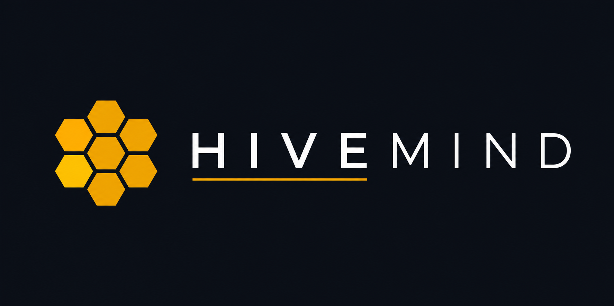

<div align="center">



# HiveMind 🐝

**A Swarm Intelligence Prediction Engine — rehearse the future with thousands of AI agents before making real decisions.**

Upload seed material (news, reports, stories) → HiveMind extracts reality seeds → builds a knowledge graph → spawns a parallel digital society of AI agents with memory and personalities → simulates how opinion evolves → delivers a prediction report you can interrogate.

`Multi-Agent Simulation` · `GraphRAG` · `Agent Memory` · `Opinion Dynamics` · `LLM Applications`

</div>

---

## ⚡ Overview

**HiveMind** is a next-generation AI prediction engine powered by multi-agent technology.

You only need to: **upload seed material** (a data report, breaking news, or a story) and **describe your prediction goal in natural language**.

HiveMind will return:

1. **A detailed prediction report** — how the situation is likely to evolve
2. **A deeply interactive digital world** — chat with any agent that lived through the simulation

### The workflow

| Step | What happens |
|------|-------------|
| **1 · Graph Build** | Seed extraction · individual/collective memory injection · GraphRAG construction |
| **2 · Env Setup** | Entity-relationship extraction · persona generation · agent configuration injection |
| **3 · Simulation** | Dual-platform parallel simulation · auto-parsed prediction requirements · dynamic temporal memory updates |
| **4 · Report** | ReportAgent with a rich toolset interrogates the post-simulation environment |
| **5 · Interaction** | Chat with any simulated individual · converse with the ReportAgent |

## 🚀 Quick Start

**Prerequisites:** Node.js 18+, Python 3.11–3.12, [uv](https://docs.astral.sh/uv/)

```bash
# 1. Configure environment variables
cp .env.example .env     # then fill in your keys (see .env.example comments)

# 2. Install all dependencies (root + frontend + backend)
npm run setup:all

# 3. Start both services
npm run dev
```

| Service | URL |
|---------|-----|
| Frontend | http://localhost:3000 |
| Backend API | http://localhost:5001 |

Docker alternative:

```bash
cp .env.example .env
docker compose up -d
```

## ☁️ Cloud Deployment

HiveMind is designed to run fully online on free tiers — frontend on **Vercel**, backend on **Render** (see `docs/` — coming soon).

## 🔧 Tech Stack

- **Frontend:** Vue 3 · Vite · D3.js (knowledge-graph visualisation) · vue-i18n
- **Backend:** Python · Flask · OpenAI-compatible LLM SDK (default: Google Gemini)
- **Agent memory:** [Zep Cloud](https://app.getzep.com/) temporal knowledge graph
- **Simulation engine:** [OASIS](https://github.com/camel-ai/oasis) by CAMEL-AI — million-scale social simulation

## 📄 License & Attribution

HiveMind is **AGPL-3.0 licensed**.

This project is built on top of [MiroFish](https://github.com/666ghj/MiroFish) by 666ghj and contributors (AGPL-3.0), with substantial redesign and extensions by the HiveMind contributors. Massive thanks to the MiroFish team and to [CAMEL-AI/OASIS](https://github.com/camel-ai/oasis) for open-sourcing their simulation engine.
